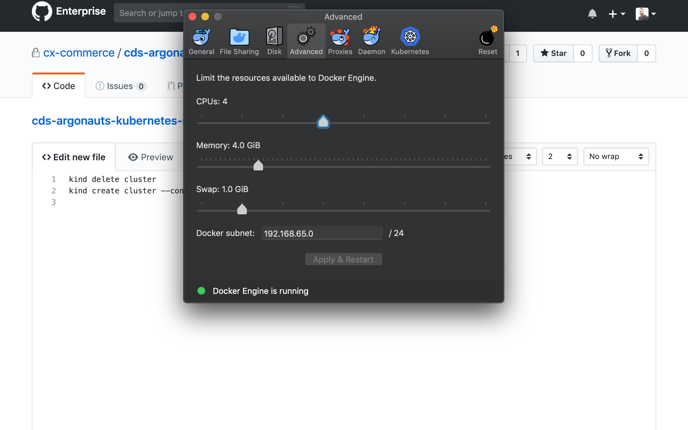

## Steps:

1. deploy the Cert manager - this deploys some new CRDs 
2. create a certificate issuer issuer resource
    -  create a tachnical aws user for and setup in cert issuer
    -  this is required to complete the ACME challenge that lets encrypt issues, to verify the domain.
3. Create a Certificate resource with, domain and k8 secret name to store cert in it.
4. Use cert secretz in nginx or istio ingress controllers. 

links https://itnext.io/automated-tls-with-cert-manager-and-letsencrypt-for-kubernetes-7daaa5e0cae4
---
## Local tests
create a kind cluster:
- brew install kind
- 
- kind-config.yaml
```yaml
kind: Cluster
apiVersion: kind.x-k8s.io/v1alpha4
nodes:
- role: control-plane
- role: worker
- role: worker
- role: worker
```
- create cluster
```bash
kind create cluster --name certs --config kind-config.yaml
```
---
## Install cert-manager
```bash
helm install \
  cert-manager jetstack/cert-manager \
  --namespace cert-manager \
  --version v1.1.0 \
  # --set installCRDs=true
```
### [Verifying-the-installation](https://cert-manager.io/docs/installation/kubernetes/#verifying-the-installation)

This is done by creating a self signed certificate issuer, this can also be used for istio CA certs and rotate them automatically.
```yaml
apiVersion: v1
kind: Namespace
metadata:
  name: cert-manager-test
---
apiVersion: cert-manager.io/v1
kind: Issuer
metadata:
  name: test-selfsigned
  namespace: cert-manager-test
spec:
  selfSigned: {}
---
apiVersion: cert-manager.io/v1
kind: Certificate
metadata:
  name: selfsigned-cert
  namespace: cert-manager-test
spec:
  dnsNames:
    - example.com
  secretName: selfsigned-cert-tls
  issuerRef:
    name: test-selfsigned
```
### [details on self signed certs](https://cert-manager.io/docs/configuration/selfsigned/)

### [Configuring-private-key-rotation](https://cert-manager.io/docs/usage/certificate/#configuring-private-key-rotation)
WARNING: This feature requires enabling the ExperimentalCertificateControllers feature gate by passing the --feature-gates=ExperimentalCertificateControllers=true flag to the controller component, or adding --set featureGates=ExperimentalCertificateControllers=true when deploying using the Helm chart.


Questions:
1. how to specify own private key or its secret name?

---
