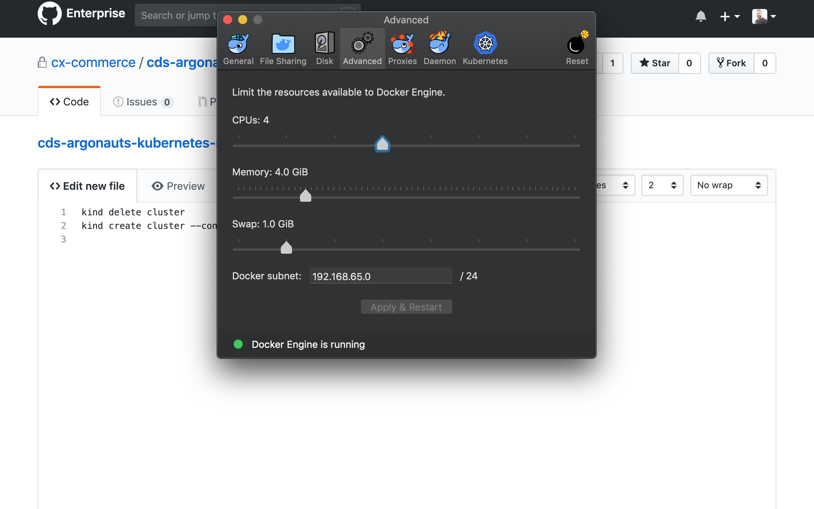

# Kind cluster intro

### Change docker preferences:

 - kind delete cluster
 - kind create cluster --config kind-config.yaml 

### Creating a k8s cluster with pre-built docker images of various k8s versions:
Kind releases a lot of pre-built node images that can be ued to create a k8s cluster of a particular version.
The pre-built images are listed at:
https://github.com/kubernetes-sigs/kind/releases

Example: `kind create cluster --config kind-config.yaml --image=kindest/node:v1.12.8@sha256:cc6e1a928a85c14b52e32ea97a198393fb68097f14c4d4c454a8a3bc1d8d486c`

### Build a new image from k8s source
 - mkdir -p $(go env GOPATH)/src/k8s.io
 - cd $(go env GOPATH)/src/k8s.io
 - run `git clone https://github.com/kubernetes/kubernetes.git`
 - switch to any release branch for e.g. `git checkout release-1.12`
 - run `kind build node-image --image=kindest/node:v12local`
 - then run `kind create cluster --config kind-config.yaml --image=kindest/node:v12local`
 
 

